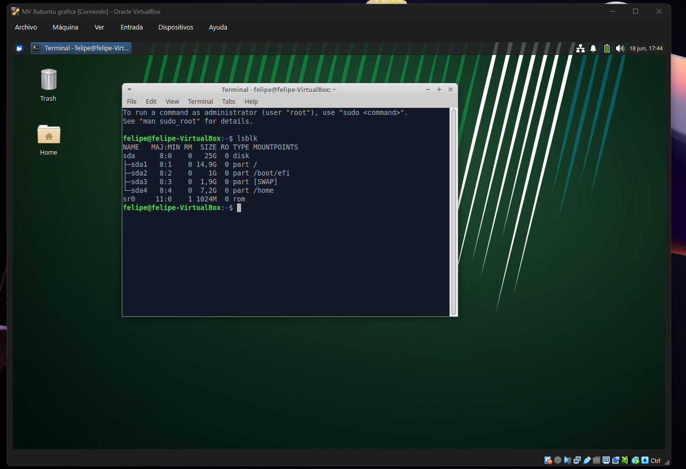
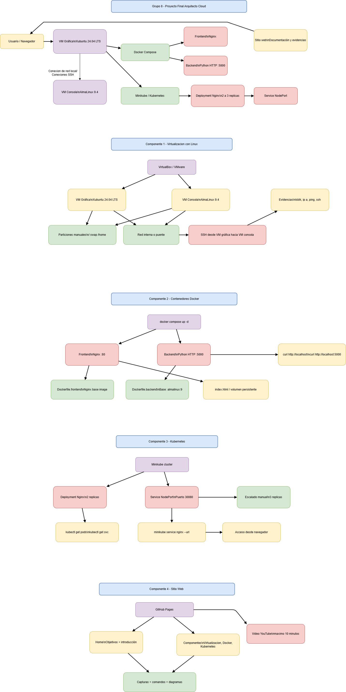

# Proyecto Final — Arquitecto Cloud
**Sistemas Operativos 750001C | Semestre 1 – 2026**
**Universidad del Valle**

---

## Equipo

| Nombre | Código | Rol |
|--------|--------|-----|
| BRAYAN FELIPE VILLAN J| 202560777 | Virtualización + Docker + Kubernetes + Documentacion|
| LEANDRO BANGUERO USURRIAGA | 202561006 |Ediccion Video + commits + Documentacion|
| JEAN PAUL DIAZ SUAREZ | 202560714|Presentacion + diagrama + commits + Documentacion|
| DANIEL BARONA ARANGO | 202460346 | Sitio Web + commits + Documentación |

**Grupo asignado:** Grupo 8  
**Distribución gráfica:** [Xubuntu 24.04 LTS]  
**Distribución consola:** [AlmaLinux 9.4]  
**Imagen Docker base:** [almalinux:9]

---

## Componente 1: Virtualización con Linux

**Distribuciones instaladas:** VM Gráfica Xubuntu 24.04 LTS + VM Consola  AlmaLinux 9.4
**Herramienta:** VirtualBox 

### Evidencias
- Captura instalación VM gráfica

- Captura particionamiento (lsblk)

- Captura configuración de red

- Captura prueba SSH funcional


### Comandos principales
```bash
ip a                          # Ver interfaces de red
lsblk                         # Ver particiones
ssh usuario@ip_vm_consola     # Conectar por SSH
```

---

## Componente 2: Contenedores Docker

**Servicios implementados:**
- Frontend: Nginx sirviendo HTML estático (puerto 80)
- Backend: Python HTTP (puerto 5000)

### Estructura de archivos
```
docker/
├── frontend/
│   ├── Dockerfile.frontend
│   └── index.html
├── backend/
│   ├── Dockerfile.backend
│   └── server.py
└── docker-compose.yml
```

### Evidencias
- Captura `docker compose up -d`

- Captura navegador accediendo al frontend

- Captura `curl http://localhost:5000`


### Comandos principales
```bash
docker compose up -d
docker ps
docker images
curl http://localhost
curl http://localhost:5000
```

---

## Componente 3: Orquestación con Kubernetes

**Herramienta:** Minikube

### Manifiestos
- `deployment.yaml` — Nginx con 2 réplicas
- `service.yaml` — NodePort en puerto 30080

### Evidencias
- Captura `kubectl get pods`

- Captura `kubectl get svc`

- Captura acceso desde navegador

- Captura escalado a 3 réplicas


### Comandos principales
```bash
minikube start
kubectl apply -f deployment.yaml
kubectl apply -f service.yaml
kubectl get pods
kubectl scale deployment nginx --replicas=3
minikube service nginx --url
```

---

## Componente 4: Sitio Web de Documentación

**URL del sitio:** [https://daniel0325a.github.io/proyecto-cloud/]  
**Video YouTube:** [https://www.youtube.com/watch?v=3d58Nv4zeVk]

### Secciones del sitio
- Home: introducción y objetivos
- Equipo: integrantes con fotos y roles
- Componentes: descripción, capturas y comandos de cada uno
- Conclusiones: aprendizajes, dificultades y recomendaciones

---

## Diagrama de Arquitectura

> Insertar imagen del diagrama (draw.io / Miro / Lucidchart)


---

## Conclusiones

1. [Aprendimos a crear un sitio web y subirlo a un host real importante para trabajar en el sector laboral tambien a orquestar con un ambiente docker y a manejar una maquina virtual es muy importante esto lo usaremos en el trabajo cuando nos toque manejar servidores ]
2. [En cuanto a las dificultades encontramos que es poco entendible la parte de kubernetes no hubo una explicacion previa la cual nos facilitara y aterrizarla para saber en que ambientes no sirven esto]
3. [una recomendacion seria ir desarrollando el proyecto conforme avanza el curso para que si hay temas como maquians virtuales que docker que se vean y se apliquen al proyecto de esta manera se aterrice a un entorno mas real ]

---

*Proyecto desarrollado para la asignatura Sistemas Operativos 750001C — Semestre 1, 2026*
